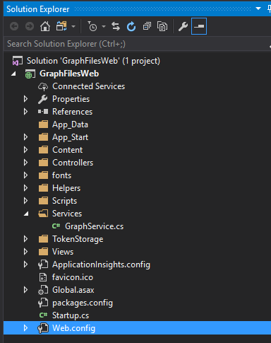

# Connect to files in OneDrive with the Microsoft Graph
In this lab, learn how to access, upload, and download files from OneDrive and OneDrive for Business using the Microsoft Graph, AAD v2 end point, and ASP.NET MVC 5.

## Overview
Through Microsoft Graph API, you can access files in OneDrive, OneDrive for Business, and Office Groups, by accessing the **drive** property of a user or group entity. You can navigate the hierarchy of a drive by path or by enumerating the contents of folders.

## Prerequisites
1. You must have an Office 365 tenant and Microsoft Azure subscription to complete this lab. If you do not have one, the lab for **O3651-7 Setting up your Developer environment in Office 365** shows you how to obtain a trial.
1. You must have Visual Studio 2017 with ASP.NET and web development workload installed.

## Register the application
In this step, you'll register an app on the Microsoft App Registration Portal. This generates the app ID and password that you'll use to configure the app in Visual Studio.

1. Sign into the [Microsoft App Registration Portal](https://apps.dev.microsoft.com "Microsoft App Registration Portal") using either your personal or work or school account.
2. Choose **Add an app**.
3. Enter a name for the app, and choose Create application.
    > The registration page displays, listing the properties of your app.

4. Copy the application ID. This is the unique identifier for your app.
5. Under **Application Secrets**, choose **Generate New Password**. Copy the password from the **New password generated** dialog.
    > You'll use the application ID and password to configure the app.

6. Under **Platforms**, choose **Add platform > Web**.
7. Make sure the **Allow Implicit Flow** check box is selected, and enter **https://localhost:44304/** as the Redirect URI.
    > The Allow Implicit Flow option enables the OpenID Connect hybrid flow. During authentication, this enables the app to receive both sign-in info (the id_token) and artifacts (in this case, an authorization code) that the app uses to obtain an access token.
 
8. Modify the **Microsoft Graph Permissions** value to include the required **Files.ReadWrite, User.Read** scope.
	

9. Choose **Save**.


## Exercise 1: Configure a starter project using Azure Active Directory v2 authentication
1. Locate the [Starter Project](./Starter%20Project) folder that contains a starter project. The starter project is an ASP.NET MVC5 web application that you will update to call the Microsoft Graph.

2. **Launch** Visual Studio 2017 and **open** the starter project.

	

3. Open the **Web.config** file and find the **appSettings** element.
	

2. Locate the app configuration keys in the appSettings element. Replace the **ENTER_YOUR_CLIENT_ID** and **ENTER_YOUR_SECRET** placeholder values with the values you just copied.
3. Paste **Files.ReadWrite User.Read** into the value for **ida:GraphScopes**.
	

4. Press F5 to compile and launch your new application in the default browser.
   1. When the Graph and AAD v2 Auth Endpoint Starter page appears, click **Sign in** and log on to your Office 365 account.
   2. Review the permissions the application is requesting, and click **Accept**.
   3. Now that you are signed in to your application, exercise 1 is complete!
   4. Make sure to stop debugging before continuing to exercise 2.

## Exercise 2: Access OneDrive for Business files through Microsoft Graph

In this exercise, you will build on exercise 1 to connect to the Microsoft Graph and perform CRUD operations associated with the files in OneDrive for Business or OneDrive.

### Create the Files controller and use the Microsoft Graph

1. Create a new controller to process the requests for files and send them to Graph API.
  1. Find the **Controllers** folder under **GraphFilesWeb**, right-click it and select **Add** > **New Scaffolded Item...**.
  2. In the **Add Scaffold** dialog, select **MVC 5 Controller - Empty**, and choose **Add**.
  3. Change the name of the controller to **FilesController** and click **Add**.

2. **Add** the following reference to the top of the `FilesController` class.

    ```csharp
	using System.Threading.Tasks;
	using System.Collections.Generic;
	using System.Web.Mvc;
	using Microsoft.Graph;
	using GraphFilesWeb.Helpers;
	using GraphFilesWeb.Services;
    ```

3. **Add** the following code into **FilesController** to create an instance of **GraphService**
    ```csharp
	GraphService graphService = new GraphService();
    ```

4. **Replace** the existing `Index()` method in the `FilesController` class with this version which returns a view of items in the root of the user's OneDrive.

    ```csharp
    [Authorize]
    public async Task<ActionResult> Index(int? pageSize, string nextLink)
    {
        try
        {
            GraphServiceClient graphClient = SDKHelper.GetAuthenticatedClient();
            var results = await graphService.GetMyFiles(graphClient, pageSize, nextLink);
            if (null != results.NextPageRequest)
            {
                ViewBag.NextLink = results.NextPageRequest.GetHttpRequestMessage().RequestUri;
            }
            else
            {
                ViewBag.NextLink = null;
            }
            return View(results);
        }
        catch (ServiceException se)
        {
            if (se.Error.Message == "Caller needs to authenticate.") return new EmptyResult();
            return RedirectToAction("Index", "Error", new { message = se.Error.Message + Request.RawUrl + ": " + se.Error.Message });
        }
    }
    ```

5. **Open** GraphService.cs file under the **Services** folder. **Add** the following code to `GraphService` to get files from the user's OneDrive.
    ```csharp
    public async Task<IDriveItemChildrenCollectionPage> GetMyFiles(GraphServiceClient graphClient, int? pageSize, string nextLink)
    {
        pageSize = pageSize ?? 25;
        var request = graphClient.Me.Drive.Root.Children.Request().Top(pageSize.Value);
        if (nextLink != null){
            request = new DriveItemChildrenCollectionRequest(nextLink, graphClient, null);
        }
        var results = await request.GetAsync();
        return results;
    }
    ```
 
6. **Open** FilesController.cs file. **Add** the following code to the `FilesController` to delete a file from the user's OneDrive.

    ```csharp
    public async Task<ActionResult> Delete(string itemId, string etag)
    {
        GraphServiceClient graphClient = SDKHelper.GetAuthenticatedClient();
        await graphService.DeleteFile(graphClient, itemId, etag);
        return Redirect("/Files");
    }
    ```

7. **Add** the following code to `GraphService` to delete a file from the user's OneDrive.
    ```csharp
    public async Task DeleteFile(GraphServiceClient graphClient, string itemId, string etag)
    {
        var request = graphClient.Me.Drive.Items[itemId].Request(new List<Option> { new HeaderOption("If-Match", etag) });
        await request.DeleteAsync();
        return;
    }
    ```

8. **Add** the following code to the `FilesController` to upload a new file to the user's OneDrive.

    ```csharp
    [Authorize]
    public async Task<ActionResult> Upload()
    {
        GraphServiceClient client = SDKHelper.GetAuthenticatedClient();

        foreach (string key in Request.Files)
        {
            var fileInRequest = Request.Files[key];
            if (fileInRequest != null && fileInRequest.ContentLength > 0)
            {
                var filename = System.IO.Path.GetFileName(fileInRequest.FileName);
                var request = client.Me.Drive.Root.Children[filename].Content.Request();
                var uploadedFile = await request.PutAsync<DriveItem>(fileInRequest.InputStream);
            }
        }

        return Redirect("/Files");
    }
    ```

9. **Add** the following code to `GraphService` to upload a file from the user's OneDrive.
    ```csharp
    public async Task UploadFile(GraphServiceClient graphClient, string filename, Stream content)
    {
        var request = graphClient.Me.Drive.Root.Children[filename].Content.Request();
        var uploadedFile = await request.PutAsync<DriveItem>(content);
        return;
    }
    ```

### Create the files view

In this section you'll wire up the Controller you created in the previous section to an MVC view that will display the contents of the OneDrive folder selected.
1. Locate the **Views/Shared** folder in the project.
2. Open the **_Layout.cshtml** file found in the **Views/Shared** folder.
    1. Locate the part of the file that includes a few links at the top of the page. It should look similar to the following code:
	    ```asp
        <ul class="nav navbar-nav">
            <li>@Html.ActionLink("Home", "Index", "Home")</li>
            <li>@Html.ActionLink("About", "About", "Home")</li>
            <li>@Html.ActionLink("Contact", "Contact", "Home")</li>
        </ul>
	    ```

    2. Update that navigation to add the "OneDrive Files" link and connect this to the controller you just created.
	    ```asp
        <ul class="nav navbar-nav">
            <li>@Html.ActionLink("Home", "Index", "Home")</li>
            <li>@Html.ActionLink("About", "About", "Home")</li>
            <li>@Html.ActionLink("Contact", "Contact", "Home")</li>
            <li>@Html.ActionLink("OneDrive Files", "Index", "Files")</li>
        </ul>
	    ```

3. Create a new **View** for OneDrive Files:
   1. Find the **Views\Files** folder in the project.
   2. Right-click the **Files** folder and select **Add > MVC 5 View Page (Razor)**, change the file name to **Index**, and click **Add**.

4. **Replace** all of the code in the **Files/Index.cshtml** with the following:

    ```asp
	@model IEnumerable<Microsoft.Graph.DriveItem>

	@{ ViewBag.Title = "My Files"; }
	
	<h2>My Files</h2>
	
	<div class="row" style="margin-top:50px;">
	    <div class="col-sm-12">
	        <div class="table-responsive">
	            <table id="filesTable" class="table table-striped table-bordered">
	                <thead>
	                    <tr>
	                        <th></th>
	                        <th>ID</th>
	                        <th>Name</th>
	                        <th>Created</th>
	                        <th>Modified</th>
	                    </tr>
	                </thead>
	                <tbody>
	                    @foreach (var file in Model)
	                    {
	                        <tr>
	                            <td>
	                                @{
	                                    //Place delete control here
	                                }
	                            </td>
	                            <td>
	                                @file.Id
	                            </td>
	                            <td>
	                                <a href="@file.WebUrl">@file.Name</a>
	                            </td>
	                            <td>
	                                @file.CreatedDateTime
	                            </td>
	                            <td>
	                                @file.LastModifiedDateTime
	                            </td>
	                        </tr>
	                                    }
	                </tbody>
	            </table>
	        </div>
	        <div class="btn btn-group-sm">
	            @{
	                //Place Paging controls here
	            }
	        </div>
	        @{
	            // Place upload controls here
	        }
	    </div>
	</div>
    ```

5. In **Visual Studio**, hit **F5** to begin debugging.
6. When prompted, log in with your Office 365 Account.
7. Click the link **OneDrive Files** on the top of the home page.
8. Verify that your application displays files from the user's OneDrive.
	

9. Stop debugging. You've connected your app to OneDrive files through Graph API!

### Paging through the results
1. **Add** the following code under the comment `//Place Paging controls here` in **Index.cshtml**.
    ```csharp
    Dictionary<string, object> attributes2 = new Dictionary<string, object>();
    attributes2.Add("class", "btn btn-default");

    if (null != ViewBag.NextLink)
    {
      RouteValueDictionary routeValues3 = new RouteValueDictionary();
      routeValues3.Add("nextLink", ViewBag.NextLink);
      @Html.ActionLink("Next Page", "Index", "Files", routeValues3, attributes2);
    }
    ```
2. Press **F5** to start debugging.
3. Click the **Next** button to page through results. Use the browser's back button to return to previous pages.
	

### Uploading a file

1. **Add** the following code under the comment `// Place upload controls here` in **Index.cshtml** to create an upload control.
    ```asp
     <div class="row" style="margin-top:50px;">
         <div class="col-sm-12">
             @using (Html.BeginForm("Upload", "Files", FormMethod.Post, new { enctype = "multipart/form-data" }))
             {
                 <input type="file" id="file" name="file" class="btn btn-default" />
                 <input type="submit" id="submit" name="submit" value="Upload" class="btn btn-default" />
             }
         </div>
     </div>
    ```

2. Press **F5** to begin debugging.
3. Test uploading a new file and ensure it appears in the folder list.
	

### Delete an item

1. In the **Index.cshtml** file under **Views/Files** folder, **add** the following code under the comment `//Place delete control here` to delete a file.
  	```asp
	  Dictionary<string, object> attributes1 = new Dictionary<string, object>();
	  attributes1.Add("class", "btn btn-warning");
	  RouteValueDictionary routeValues1 = new RouteValueDictionary();
	  routeValues1.Add("itemId", file.Id);
	  routeValues1.Add("etag", file.ETag);
	  @Html.ActionLink("X", "Delete", "Files", routeValues1, attributes1);
  	```

2. Press **F5** to begin debugging.
3. Test the delete functionality in the application by deleting a file.

**Congratulations!** In this exercise you have created an MVC application that uses Microsoft Graph to view and manage files in OneDrive!
