# Create bots, connectors, and tabs in Microsoft Teams
Microsoft Teams is a chat-based conversation tool, that contains everything your team needs to keep in touch.  You can extend Teams by building Bots and Connectors, as well as extending the user interface with custom Tabs.  In this training module, we'll build a Bot that integrates with Teams.

## Prerequisites
1. You must have an Office 365 tenant and Windows Azure subscription to complete this lab. If you do not have one, the lab for **O3651-7 Setting up your Developer environment in Office 365** shows you how to obtain a trial.
2. You must have Visual Studio 2017 with workload ASP.NET and web application and the Bot Application template installed.
   - Download and install the Bot Application template zip from the direct download link [http://aka.ms/bf-bc-vstemplate](http://aka.ms/bf-bc-vstemplate).
   - Save the zip file to your Visual Studio 2017 templates directory which is traditionally located in `%USERPROFILE%\Documents\Visual Studio 2017\Templates\ProjectTemplates\`.
   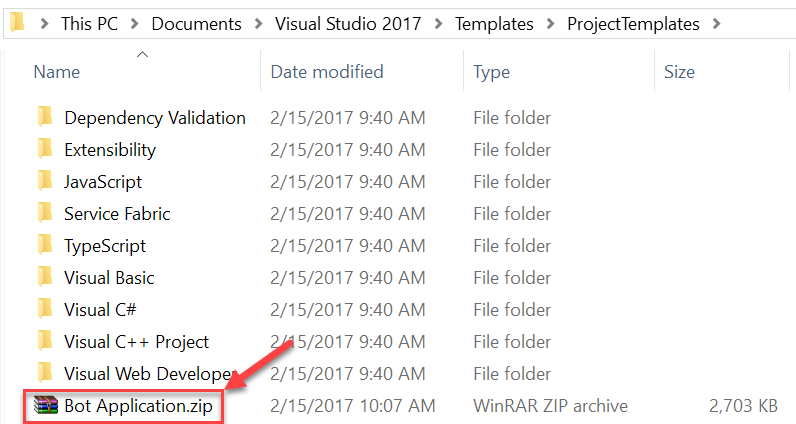  
3. You must turn on Microsoft Teams for your organization and enable side-loading for your bots.
   - Follow the instructions in this link [https://msdn.microsoft.com/en-us/microsoft-teams/setup](https://msdn.microsoft.com/en-us/microsoft-teams/setup).
4. You must have Microsoft Teams installed.
   - Download it at this link [https://teams.microsoft.com/downloads](https://teams.microsoft.com/downloads).

## Lab Setup: Create a Bot for Teams

## Exercise 1: Building your Bot
In this exercise, you will create a Azure Web App to host your bot application and use VS to build your bot.

1. In a web browser, open the [Azure Management Portal](https://portal.azure.com/) and log in with an administrator account.
2. Click the **+** button.
3. Click **Web + Mobile** | **Web App**.
4. Enter a name(eg. trainingcontentbotapi) for the web app in the **App name** textbox.
5. Select a **Subscription**.
6. Create or select a **Resource Group**.
7. Create or select an **App Service Plan**.
8. Click the **Create** button.

	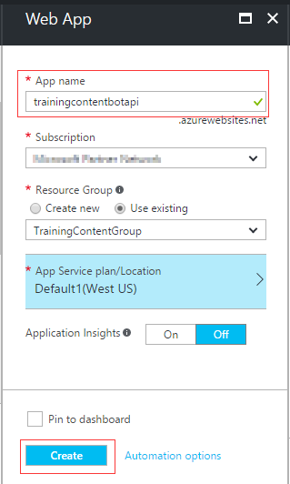

9. After the Web Site is completed, click **App Services**.
10. Click the Web Site you just created.
11. Copy the web site **URL** and save it.  You will use it later.

	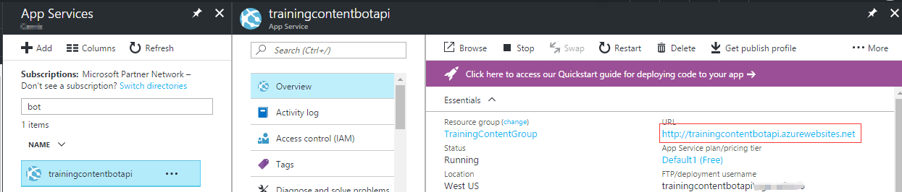

12. Launch **Visual Studio 2017**.
13. In Visual Studio 2017 select **File | New | Project**.
14. Create a new Visual C# project using the **Bot Application** template.

	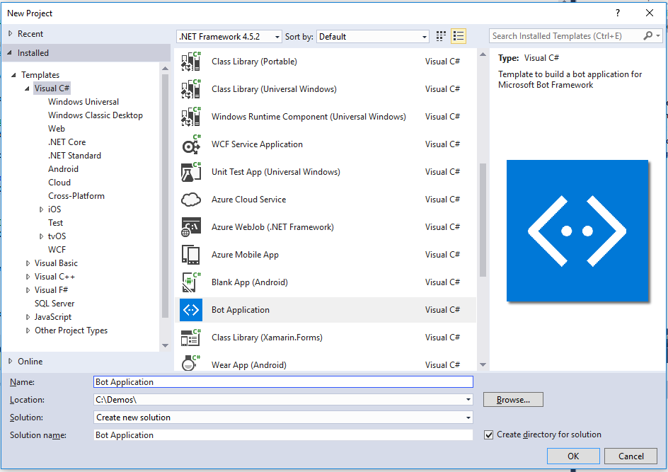  

	The template is a fully functional Echo Bot that takes the user's text utterance as input and returns it as output. In order to run the bot inside Microsoft Teams:
	
	- The bot must be registered with the Bot Connector.
	- The AppId and AppPassword from the Bot Framework registration page have to be recorded in the project's web.config.
	- The Bot must be added to Microsoft Teams.
	
	The core functionality of the Bot Template is all in the Post method within the **Controllers\MessagesController.cs** class, which invokes code in **Dialogs\RootDialog.cs** class.

	The **BotAuthentication** decoration on the **Controllers\MessagesController.cs** class is used to validate your Bot Connector credentials over HTTPS.

	```csharp
	[BotAuthentication]
	public class MessagesController : ApiController
	```

	The code in the **Dialogs\RootDialog.cs** class that comes with the new Bot project takes user's text utterance as input, then return a reply to the user using the **PostAsync** method.  The out of the box reply displays the user's text utterance and how many characters it contained.  
	
	```csharp
	private async Task MessageReceivedAsync(IDialogContext context, IAwaitable<object> result)
	{
	    var activity = await result as Activity;
	
	    // calculate something for us to return
	    int length = (activity.Text ?? string.Empty).Length;
	
	    // return our reply to the user
	    await context.PostAsync($"You sent {activity.Text} which was {length} characters");
	
	    context.Wait(MessageReceivedAsync);
	}
	```
	
	In this lab you will modify the **Dialogs\RootDialog.cs** class to answer the question "What is our inventory of replacement tires?" and return a random number.
15. Open the **Dialogs\RootDialog.cs** class.
16. Replace the Post method with the following code.

	```csharp	
    private async Task MessageReceivedAsync(IDialogContext context, IAwaitable<object> result)
    {
        var activity = await result as Activity;
        if (activity.Text.ToLower().Equals("what is our inventory of replacement tires?"))
        {
            await context.PostAsync($"{new Random().Next(1, 100)}");
        }
        else
        {
            // calculate something for us to return
            int length = (activity.Text ?? string.Empty).Length;

            // return our reply to the user
            await context.PostAsync($"You sent {activity.Text} which was {length} characters");
        }

        context.Wait(MessageReceivedAsync);
    }
	```
17. Right click on the project in the Solution Explorer and select **Publish**.
18. Select **Microsoft Azure App Service** as the publish target.
19. Select the **Select Existing** radio button.
20. Click the **Publish** button.
21. Select the Subscription where you created the Azure Web App.
22. Select the Azure Web App(eg. trainingcontentbotapi) that you created.
23. Click the **OK** button.

	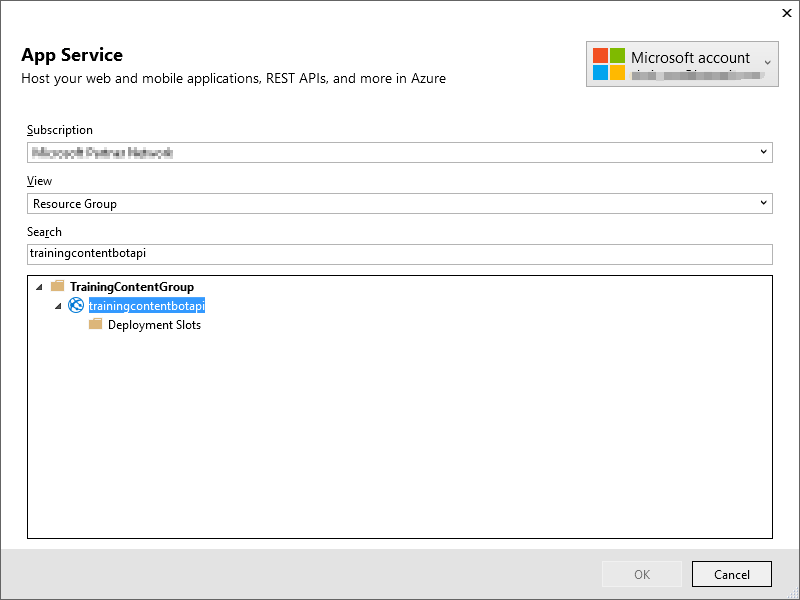

24. Click the **Publish** button, wait and make sure the Bot is successfully published to the Azure web app.  

	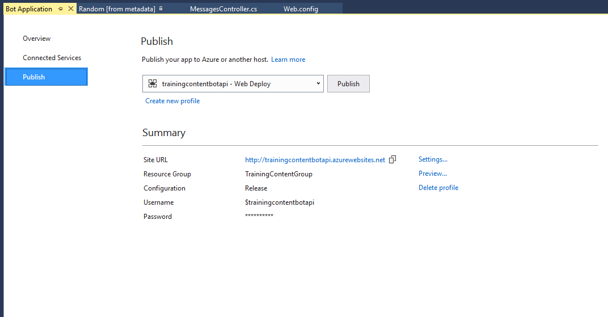

## Exercise 2: Register your Bot

1. Go to the Microsoft Bot Framework portal at [https://dev.botframework.com](https://dev.botframework.com) and sign in with your Microsoft Account.
2. Click **Register a bot**
3. In the **name** textbox, enter a name for your Bot
4. In the **handle** textbox, enter the handle for your Bot
5. In the Description textbox, enter a description for your Bot
6. In the Configuration section, in the Messaging endpoint textbox, enter the URL

	Use the URL for the web site you copied in the previous steps and add **/API/Messages** to the end of the URL.

	**Format:** [https://&lt;YOUR WEB SITE&gt;.azurewebsites.net/API/Messages](#)

	**Example:** https://trainingcontentbotapi.azurewebsites.net/API/Messages

	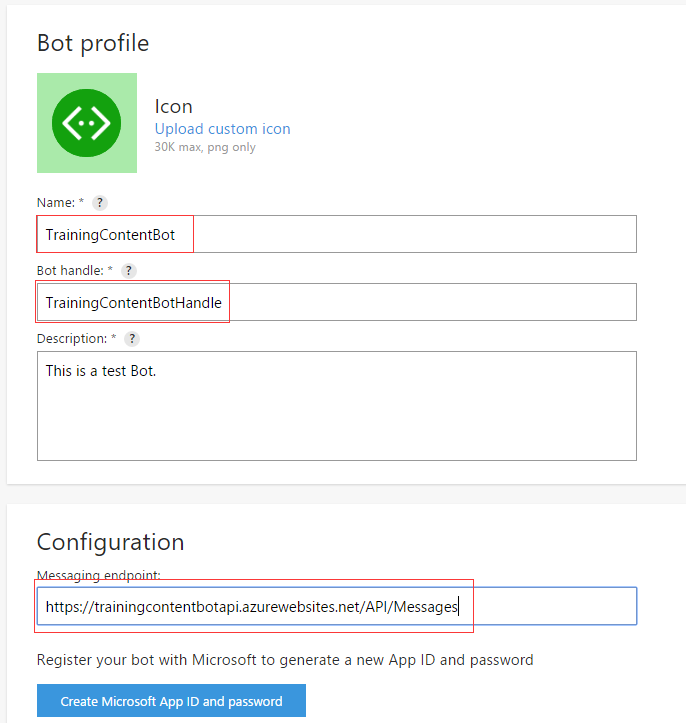

7. Click the **Create Microsoft App ID and password** button.  This opens a new browser tab/window.

	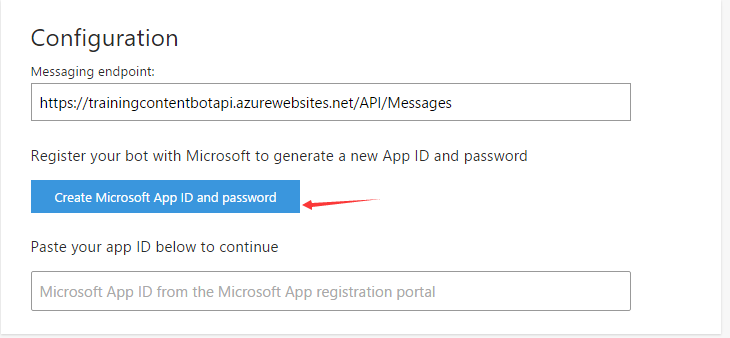

8. In the new browser tab/window, after the new application has been registered in Azure Active Directory, copy the **Application Id** and save it.  You will use it in a subsequent step.  
9. Click the **Generate an app password to continue** button.  This opens a popup and displays the password.
10. Copy the **password** and save it.  You will use it in a subsequent step.
11. Click **OK**.  This closes the popup.
12. Click the **Finish and go back to Bot Framework** button.  This closes the new browser tab/window and populates the app Id in the **Paste your app ID below to continue** textbox.

	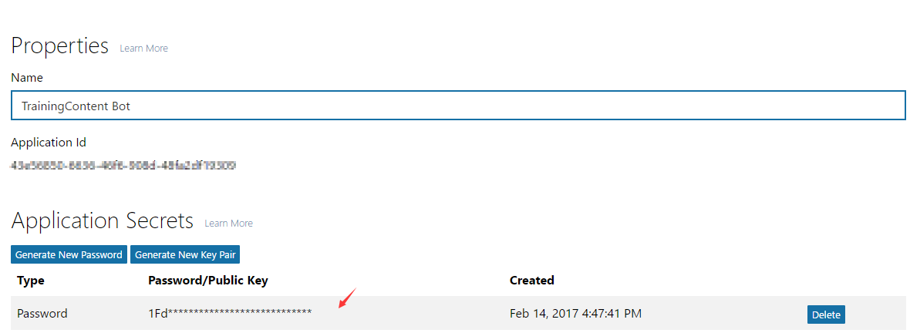
	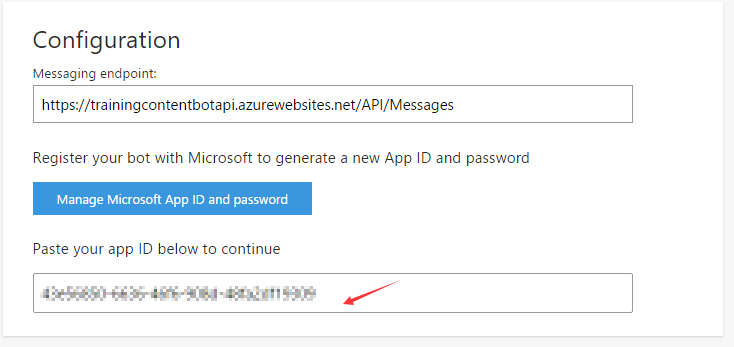

13. Select the **I agree to the Terms of Use, Privacy Statement, and Code of Conduct for the Microsoft Bot Framework (Preview).** checkbox.
14. Click the **Register** button.

	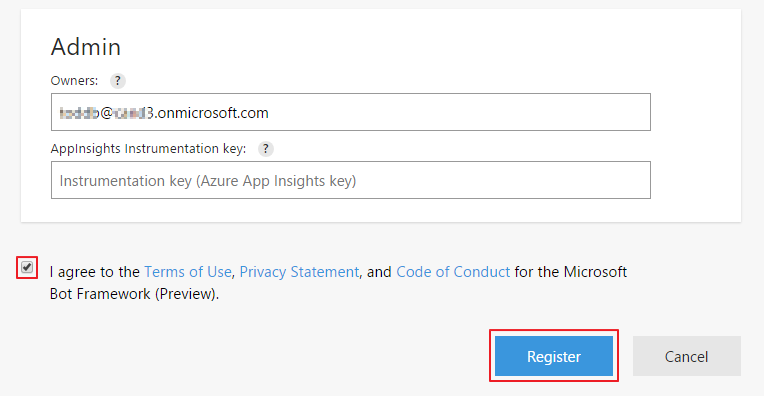

15. Verify your Bot was created successfully

	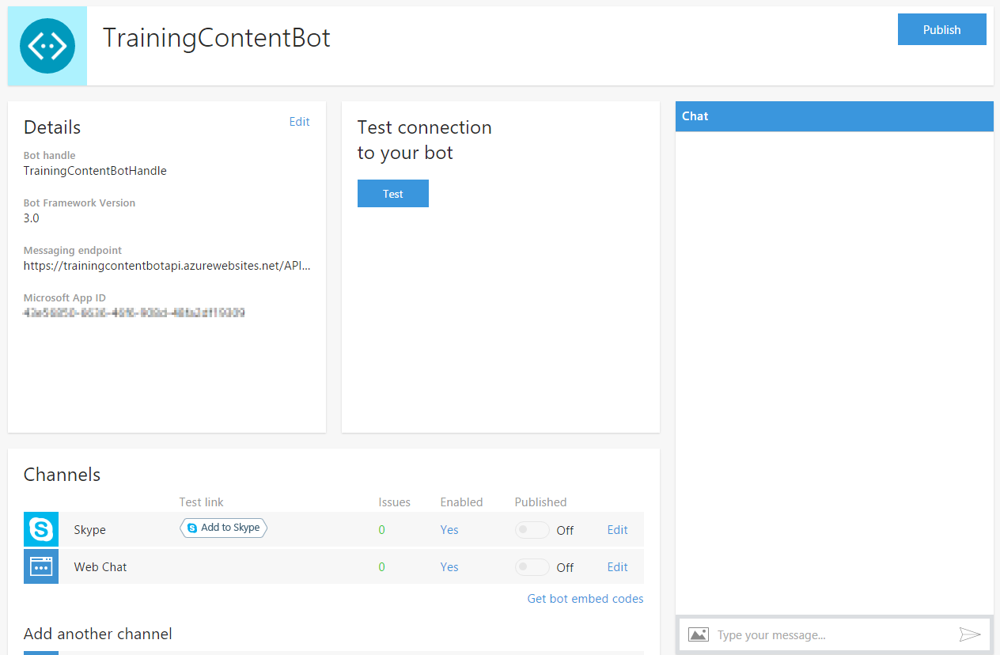

16. Open the **Web.config** file in the Visual Studio Bot project you created
17. Paste the **Microsoft App ID** and **password** that you created into the value attributes for the **MicrosoftAppId** and **MicrosoftAppPassword** keys in the **appSettings** section in the **web.config** file

	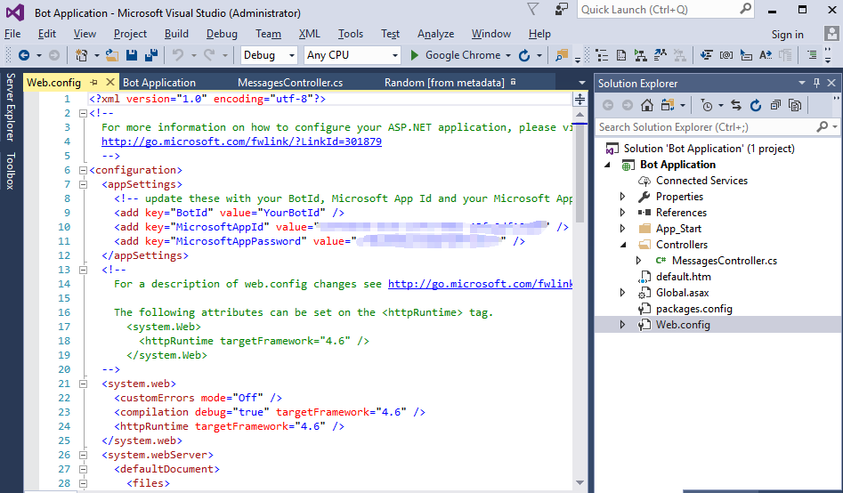

18. Save the web.config file
19. Re-publish your Bot to Azure

## Exercise 3: Add bot to Microsoft Teams

### Add Microsoft Teams as a channel of the bot.
1. Go to the Microsoft Bot Framework portal at [https://dev.botframework.com](https://dev.botframework.com) and sign in with your Microsoft Account.
2. Click **My bots** and open your bot that you just registered.
3. In the **Add another channel** section, click the **Add** link next to **Microsoft Teams**.

	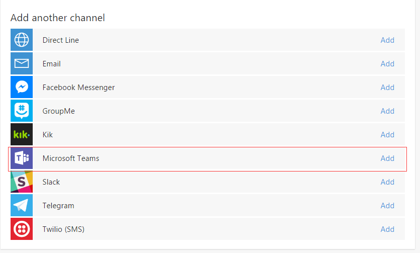

4. Click the **I'm done configuring Microsoft Teams >** button.

	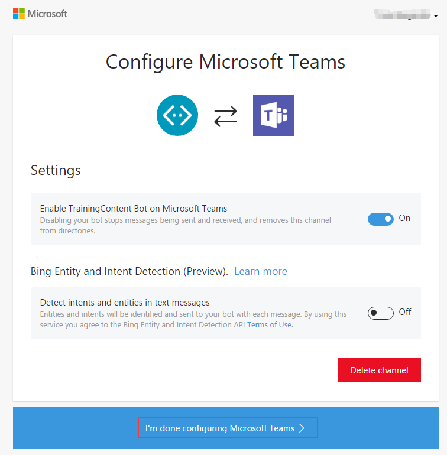

### Create a sideloadable bot package and sideload it to a team. 
1. Create an empty text file named **manifest.json**, put the following content to it:

	```json
	{
	  "$schema": "https://statics.teams.microsoft.com/sdk/v0.4/manifest/MicrosoftTeams.schema.json",
	  "manifestVersion": "0.4",
	  "id": "<BOT-FRAMEWORK-APP-ID-HERE>",
	  "version": "1.0",
	  "developer": {
	    "name": "Contoso Bot",
	    "websiteUrl": "http://www.contoso.com",
	    "privacyUrl": "http://www.contoso.com/privacy",
	    "termsOfUseUrl": "http://www.contoso.com/termsofuse"
	  },
	  "bots": [
	    {
	      "mri": "<BOT-FRAMEWORK-APP-ID-HERE>"
	    }
	  ]
	}
	```

	> **Note:** Please replace the **&lt;BOT-FRAMEWORK-APP-ID-HERE&gt;** placeholder with the **Application ID** you copied and saved when registering the bot. You could also update the **version** property and **name**, **websiteUrl**, **privacyUrl**, **termsOfUseUrl** properties in the **developer** node. 

2. Package the file **manifest.json** into a .zip file named **TrainingContentBot.zip**.
3. Open the **Microsoft Teams** desktop app and sign in.

	> **Note:** If there's not any team, please create one following the steps in [01 Tabs](../01%20Tabs/Lab.md#create-a-team).

4. Click **Teams** in the left panel, then select a Team.
5. Click **...** next to the team name and then select **View team**.

	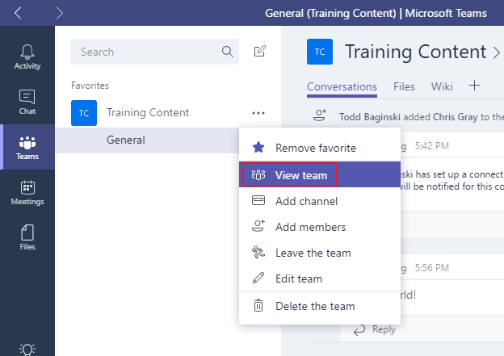

6. Click the **Bots** tab, click **Sideload a bot or tab** at the bottom right corner, select the **TrainingContentBot.zip** file, then click **Open**.

	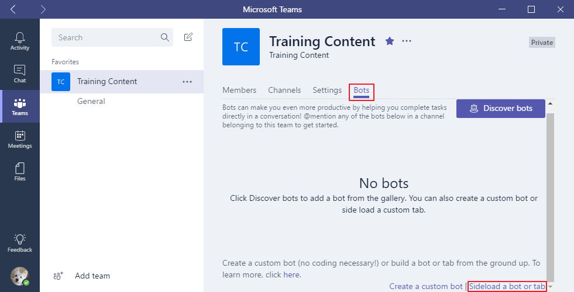

8. Wait a moment, the bot will appear in the **Bots** tab.

	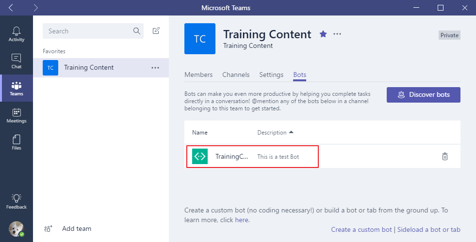

### Chat with the bot
1. Click the **Chat** button.
2. In the **Chat** pane, click the **New chat** icon
3. In the **To:** textbox, enter the Microsoft App ID for your Bot. Then click the Bot name when it pops up.

	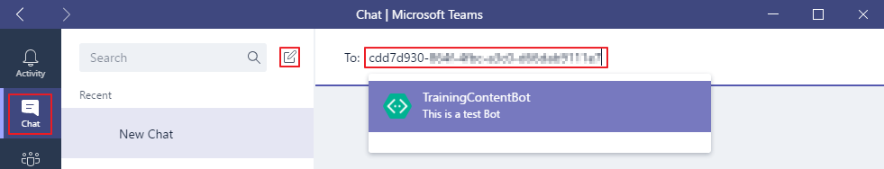

4. You have now successfully added the Bot to Microsoft Teams.

	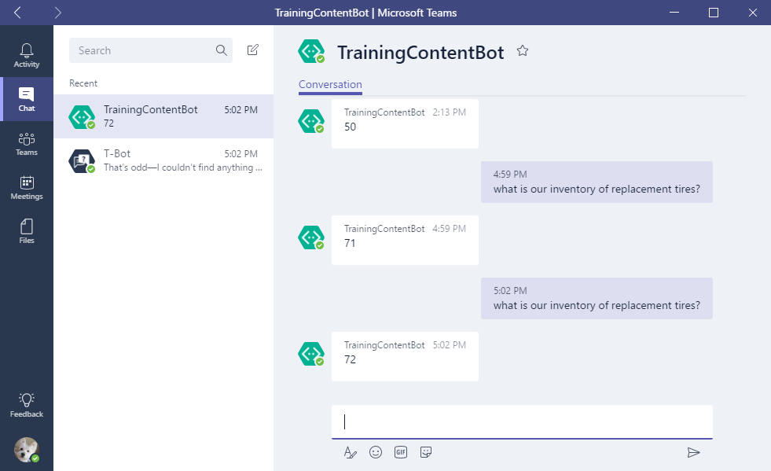

5. In the chat window, type what is our inventory of replacement tires?

	> **IMPORTANT NOTE:**  If copying and pasting the question in the chat window does not work, then type the message into the chat window.

6. Observe the random number the Bot returns. 

Congratulations! You have created a simple Bot and added it to Microsoft Teams.